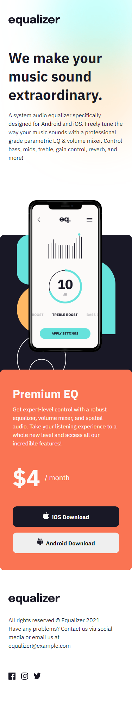

# Frontend Mentor - Equalizer landing page solution

This is a solution to the [Equalizer landing page challenge on Frontend Mentor](https://www.frontendmentor.io/challenges/equalizer-landing-page-7VJ4gp3DE). Frontend Mentor challenges help you improve your coding skills by building realistic projects. 

## Table of contents

- [Overview](#overview)
  - [The challenge](#the-challenge)
  - [Screenshot](#screenshot)
  - [Links](#links)
  - [Built with](#built-with)
  - [What I learned](#what-i-learned)
- [Author](#author)

## Overview

### The challenge

Users should be able to:

- View the optimal layout depending on their device's screen size
- See hover states for interactive elements

### Screenshot

### Links

[Github repo](https://your-solution-url.com)
[Live demo](https://fanushhh.github.io/equalizer-landing-page/)

## My process

### Built with

- Semantic HTML5 markup
- CSS custom properties
- Flexbox
- Mobile-first workflow
- [Vite-React](https://reactjs.org/) - JS library
  

### What I learned

For this one I tried a new way of creating a react app by using Vite. It is so fast and easy to use that I encourage anyone to try it.The complicated part was when I tried to deploy the app due to conflicting instructions, being used to deploy a react app using gh-pages by only applying a few settings to actually added new folders with instructions etc. Overall it was a good experience for me and I would recommend it.

## Author

- Website - [My Portfolio](fanushhh.github.io/Fanush-s-Portfolio/)
- Frontend Mentor - [@Fanushhh](https://www.frontendmentor.io/profile/Fanushhh)

